# Company A Cabinets Website — Final Report
# Live Demo Link: https://youtu.be/i8v8g-2sHOg
---

## Team Information  
**Name:** Kaicheng Xu  
**Email:** kaicheng.xu@mail.utoronto.ca

---

## Motivation  
Company A lacked a modern, dynamic website to showcase its cabinet products, handle incoming quote requests, and provide an admin dashboard for content management. Potential customers were forced to browse static PDF catalogs or generic template sites with no search or filtering. This friction led to lost leads and inefficiencies for internal staff. Our project addresses these gaps by delivering an interactive full‑stack application that streamlines product browsing, quoting, and administration.

---

## Objectives  
1. **Interactive Product Showcase**  
   Build a modern UI to showcase cabinet products by name, price, category, and image gallery—making it easy for users to explore offerings.

2. **Quote Request System**  
   Provide a quote submission form for both anonymous and logged-in users. Collect name, email, and message, and notify both the user and the admin.

3. **User Authentication & Role Management**  
   Implement a secure login and registration system using NextAuth.js (credentials-based).  
   - Logged-in users can access their personal quote dashboard.  
   - Admin users can access the admin panel to manage all data.

4. **Admin Dashboard**  
   Admins can perform CRUD operations on products, review and mark inquiries as handled, and manage registered users.

5. **Modern Tech Stack Integration**  
   Demonstrate full-stack capabilities using Next.js App Router, Server Actions, Prisma ORM, and Tailwind CSS. Cloud-based services like Cloudinary and Resend are integrated for file storage and email communication, respectively.

6. **Responsive and Usable Design**  
   Ensure the site is fully responsive, intuitive, and visually cohesive using Tailwind CSS and shadcn/ui component library.

---

## Technical Stack  
- **Framework:** Next.js 13+ App Router (Full‑Stack)  
- **Language:** TypeScript  
- **Styling:** Tailwind CSS + shadcn/ui  
- **Database:** PostgreSQL via Prisma ORM  
- **Authentication:** NextAuth.js (credentials provider, JWT sessions)  
- **Image Storage:** Cloudinary (via `cloudinary` SDK)  
- **Email Service:** Resend API for admin notifications  

---

## Features
- **Product Gallery**
Users can browse cabinets by category, search by name, and view paginated results. Products are displayed with name, price, category, and image preview.

- **Product Detail Page**
Shows full product information and a Swiper.js carousel for browsing multiple images.

- **Quote Request Form**
Users (guests or logged-in) can request a quote with name, email, and message. Quotes are stored in the database and admins receive email notifications.

- **User Accounts**
Users can register, log in, and access a personal dashboard showing their quote history and status (pending/handled).

- **Admin Dashboard**
Admins can:

Create, update, and delete products (with multiple images)

View and manage quote inquiries (mark as handled or delete)

View and delete users (except other admins)

- **Authentication & Authorization**
Role-based routing and protection using NextAuth. Only admins can access the /admin routes.

- **Cloud Integration**

Cloudinary for image uploads

Resend for email notifications

- **Modern UI**
Built with Tailwind CSS and shadcn/ui for a clean, responsive interface.

---

## User Guide

This section explains how both regular users and administrators interact with the application.

---

### 1. Home Page – Browsing Products

- Visit the homepage (`/`) to browse the list of available products.
- Use the **category buttons** to filter by Kitchen, Closet, or Bathroom.
- Use the **search bar** to filter products by name.
- Use **pagination buttons** to navigate between pages (6 items per page).

_Screenshot: Home Page_  
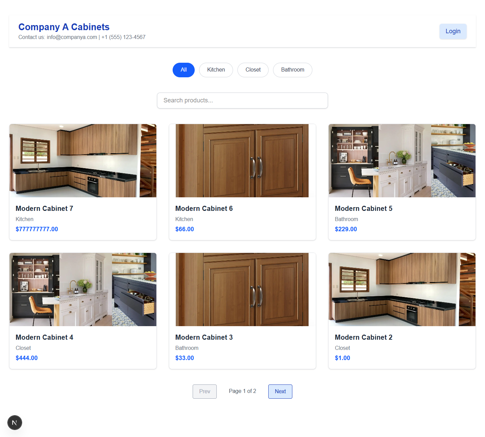

---

### 2. Product Details

- Click any product card to view detailed information.
- Details include product name, price, description, and category.
- Product images are shown in a **carousel** (Swiper.js) with left/right arrows for navigation.

_Screenshot: Product Detail Page_  
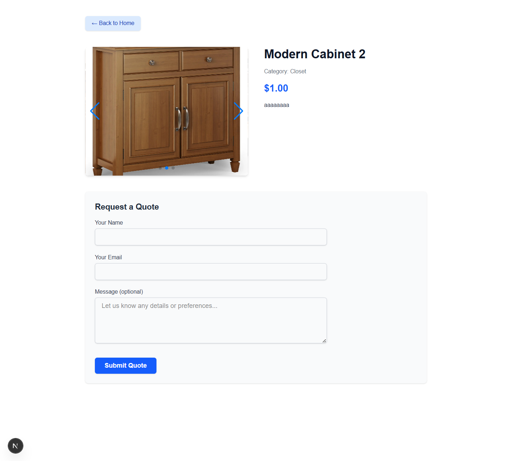

---

### 3. Submit a Quote Request

- Scroll down on the product detail page to access the **Quote Request** form.
- Enter your name, email, and optional message.
- Click **Submit Quote** to send your request.
- Quote requests are stored in the database and emailed to the admin.

_Screenshot: Quote Form_  
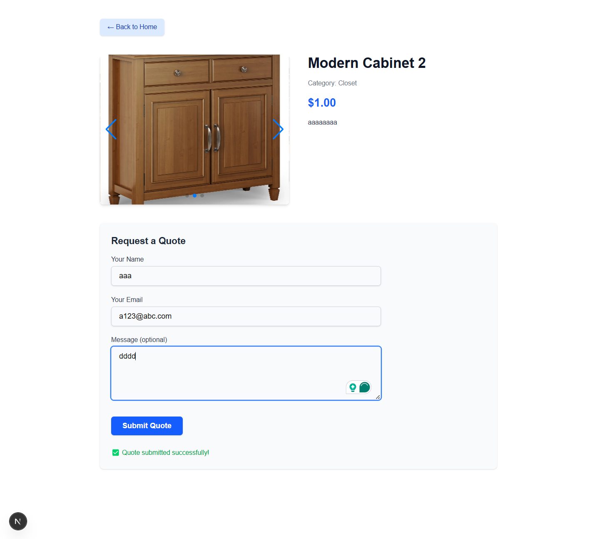
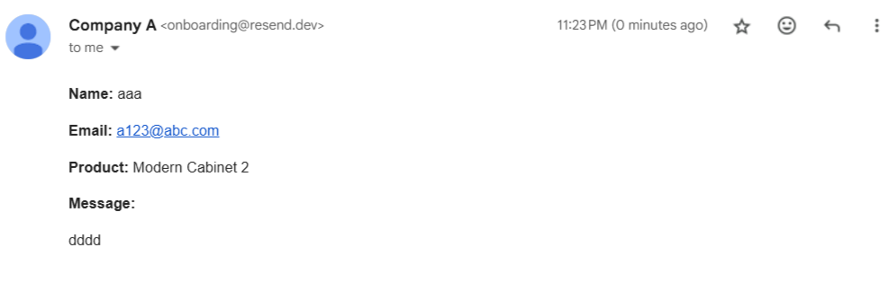

---

### 4. User Registration, Login, and Dashboard

- Click the **Login** button on the top right to sign in or register.
- After logging in, users are redirected to `/dashboard`.
- The **User Dashboard** shows past quote requests, including product name, date, and status (Pending / Handled).

_Screenshot: Login, Register, User Dashboard_  
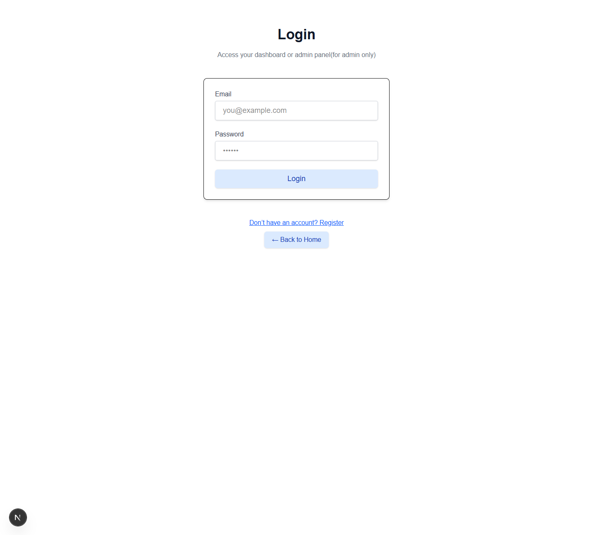
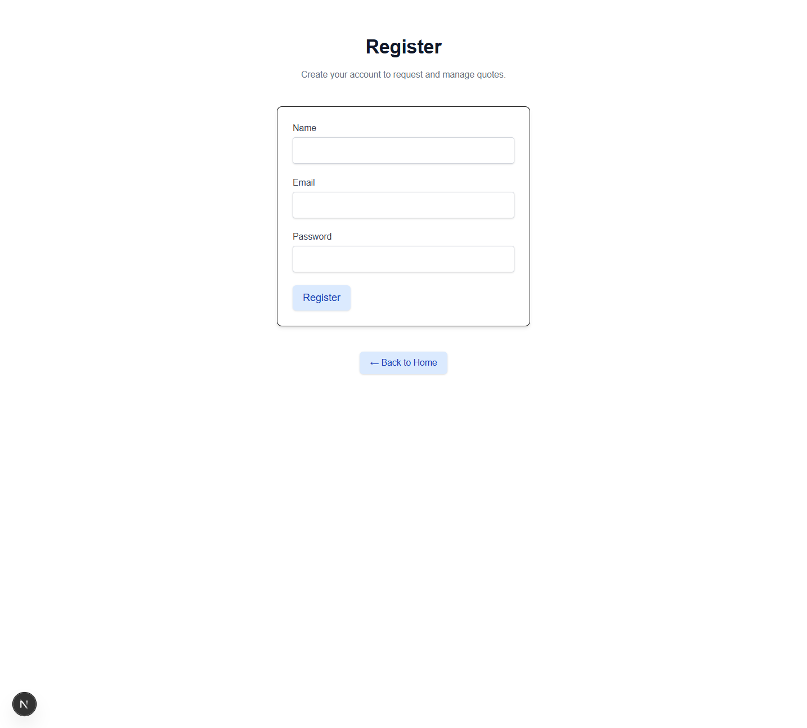
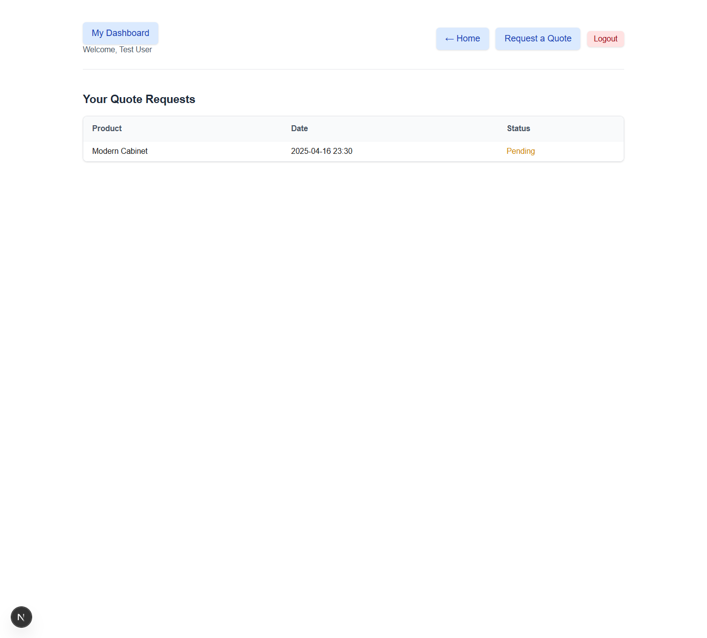

---

### 5. Admin Panel (Admins Only)

Admin users are redirected to `/admin/products` upon login.

#### Product Management
- Admins can create, update, and delete products.
- Multiple images can be uploaded per product.

_Screenshot: Admin Product Page_  
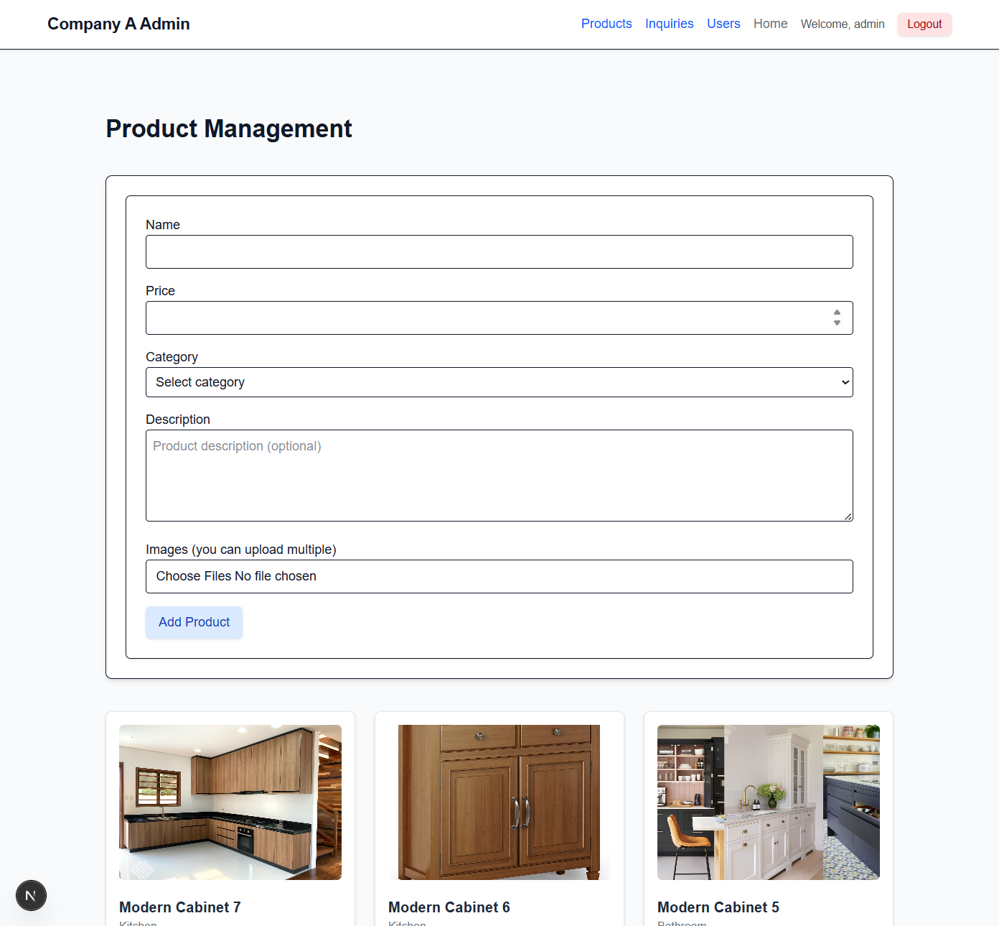
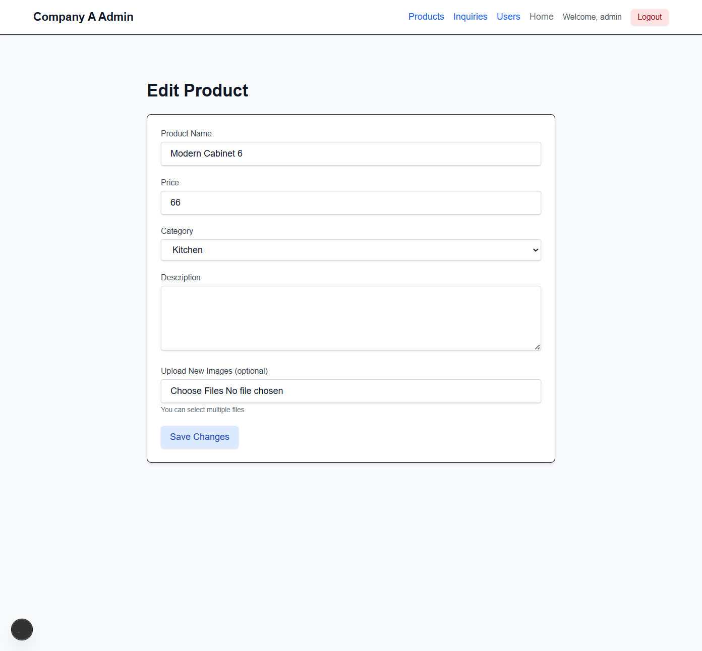
#### Inquiry Management
- Admins can view all quote requests.
- They can mark inquiries as "Handled" or delete them.

_Screenshot: Admin Inquiries Page_  
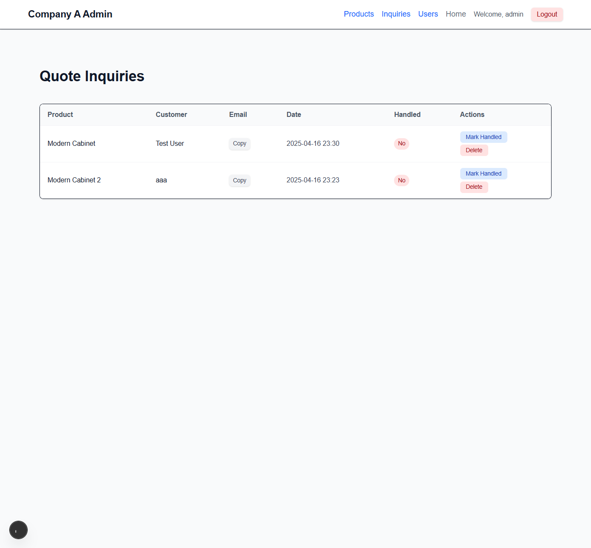

#### User Management
- Admins can view all registered users.
- Non-admin users can be deleted (admins cannot delete themselves).

_Screenshot: Admin Users Page_  
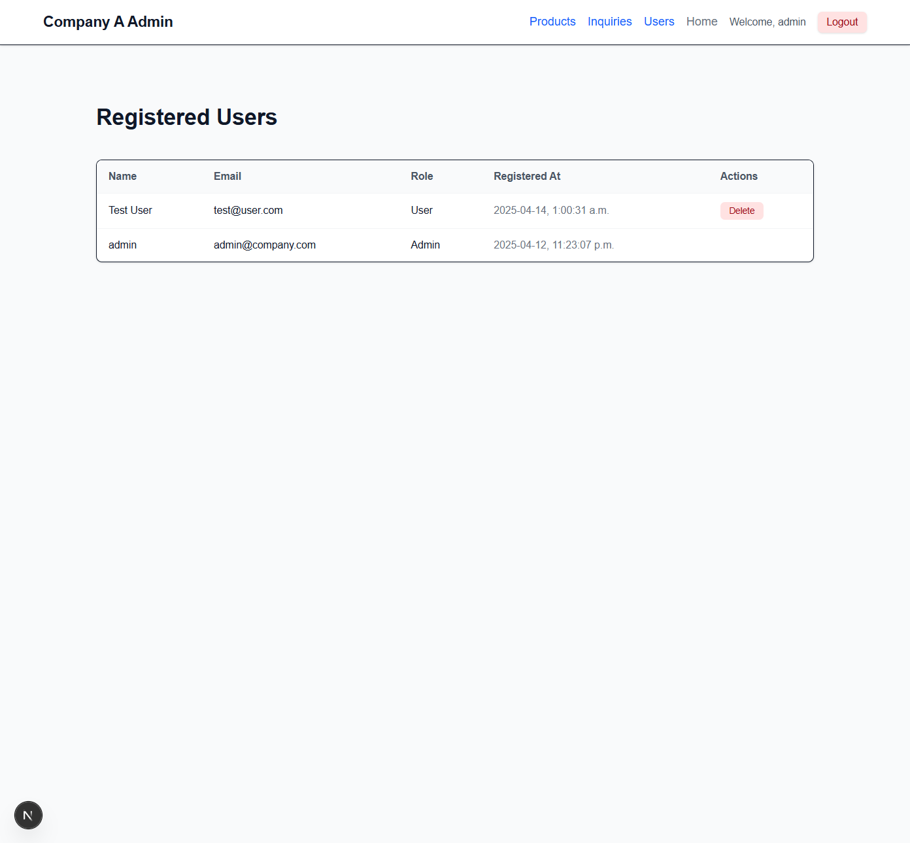

---

### 6. Access Control

- Only authenticated users can access their dashboard (`/dashboard`).
- Admin-only routes (`/admin/**`) are protected by role-based authorization.
- Unauthorized access attempts are redirected to the login page.

---

## Development Guide  

1. **Clone & Install**  

git clone <repo-url>
cd company-a-cabinets
npm install

2. **Environment Variables**
Copy .env.example ➜ .env. Variables includes:

DATABASE_URL, CLOUDINARY_CLOUD_NAME, CLOUDINARY_API_KEY, CLOUDINARY_API_SECRET, RESEND_API_KEY, ADMIN_EMAIL, NEXTAUTH_SECRET

3. **Database Initialization**

npx prisma db push
npx prisma generate

4. **Cloudinary Setup**

Create a free Cloudinary account.(You can use mine, it is already in env.)

Copy credentials into .env.

5. **Run Locally**

npm run dev

Visit http://localhost:3000

## Deployment Information

Live URL: none

Platform: none

## Individual Contributions
All development tasks—including design, implementation, deployment, and testing—were carried out solely by me (Kaicheng Xu).

## Lessons Learned & Concluding Remarks
Next.js App Router & Server Actions greatly simplify full‑stack workflows but require care with asynchronous APIs (params, cookies()).

Prisma Migrations must be followed by prisma generate to keep client types in sync.

Tailwind + shadcn/ui accelerates UI development, while Swiper adds polished UX.

Robust error handling (e.g., empty arrays, body size limits) prevents runtime surprises.

Overall, this project reinforced the value of end‑to‑end TypeScript, modern frameworks, and cloud services for rapid, maintainable web development.